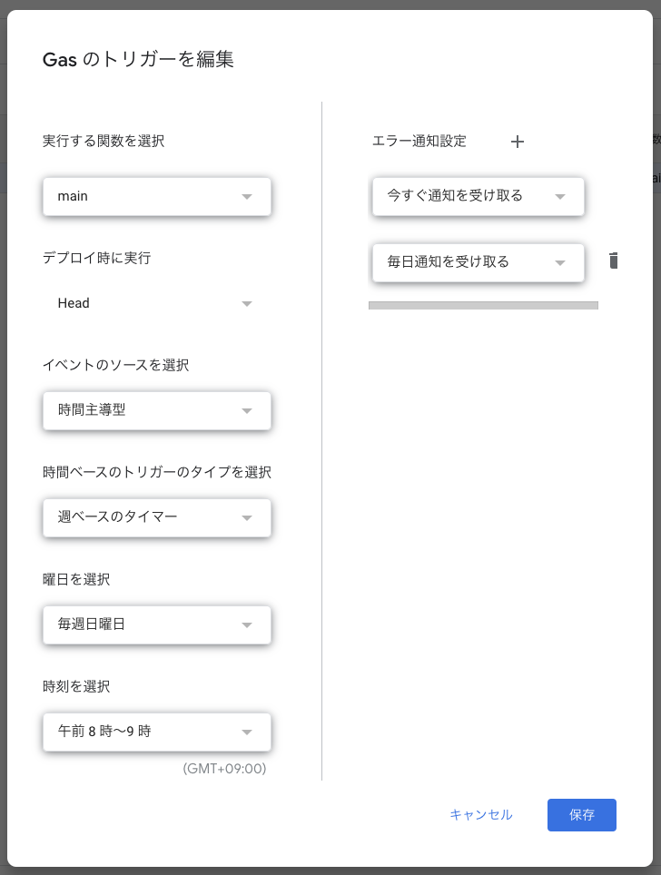

# 狩野研スケジュールアラートBot

### ⭐️ 概要
狩野研究室のスケジュールをGoogleカレンダーから取得し、指定した時間にSlackとメール通知を行うBotです。
また、研究室のゴミ出し担当者を自動で決定し、通知する機能もあります。

### 📦 使用技術
- TypeScript
- Google Apps Script
- Google Calendar API
- Google Sheets API
- Gmail API
- Slack API


### 📝 デプロイ
デプロイ後、WEB上のGASエディタ上で以下のコードを追加し、GAS上で実行可能関数を作成してください。
``` JavaScript
function main() {
  _entry._scheduleNotifyHandler();
  _entry._garbageDisposalNotifyHandler();
}
```
その後、GAS上でトリガーが適切に設定されていることを確認してください。
 


### 🛠️ 環境構築

1. 依存関係のインストール

```bash
bun install
```
or 
```bash
yarn install
```
or 
```bash
npm install
```
2. `const.ts` ファイルの作成

example.const.tsをコピーして、const.tsを作成してください。

3. claspのログイン
```bash
clasp login
```
kanolabの共用Googleアカウントでログインしてください。

<hr/>
To compile TypeScript files:

```bash
bun run build 
```

To compile and push to Google Apps Script:

```bash
bun run deploy 
```

This project was created using `bun init` in bun v1.1.12. [Bun](https://bun.sh) is a fast all-in-one JavaScript runtime.


### 📝 created by
馬場 海好  
mbaba@kanolab.net  
運用開始: 2024/7-
