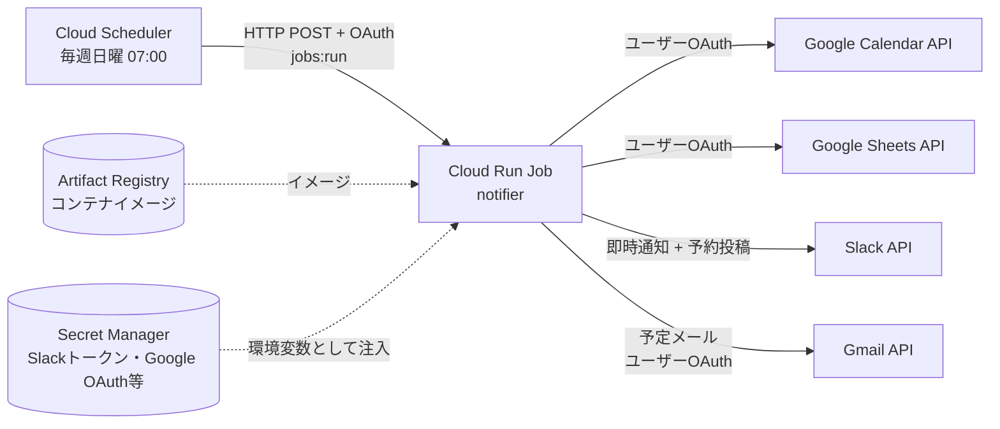
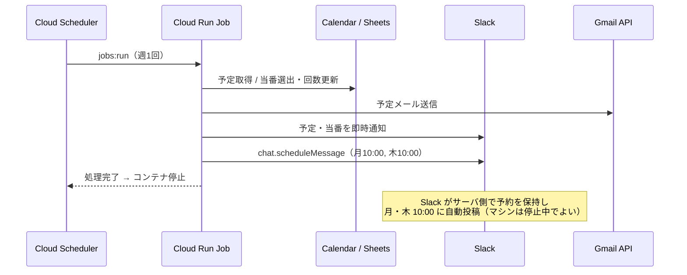

# インフラ・運用ドキュメント

狩野研スケジュール通知Botを **Google Cloud** 上で運用するための、インフラ構成・認証方式・ローカル運用・コストに関する決定事項をまとめたドキュメントです。
初めてこのプロジェクトに触れる人が、システムの全体像と「なぜこの構成なのか」を理解できることを目的としています。

---

## 1. システム概要

| 項目 | 内容 |
|---|---|
| 何をするか | 週1回（日曜朝）、Google Calendar から7日分の予定を取得し、研究室へ**メール + Slack**で通知。あわせてゴミ捨て当番を自動選出し、**Slack即時通知**と**月・木10:00の予約投稿**を作成する |
| 実行モデル | 常駐サーバではなく、**週1回だけ起動して処理し、終了するバッチジョブ** |
| データソース | Google Calendar / Google Sheets（当番表） |
| 通知先 | メール（Gmail API）・Slack |

---

## 2. アーキテクチャ



週次実行のシーケンス（予約投稿が常駐不要である点に注目）:



### 構成要素

| サービス | 役割 | 無料枠 |
|---|---|---|
| **Cloud Scheduler** | 週1回 Cloud Run Job を HTTP で直接起動（cron） | 3ジョブ/月（請求アカウント単位） |
| **Cloud Run Jobs** | 通知処理を実行して終了するバッチ実行基盤 | 180,000 vCPU秒・360,000 GiB秒/月 |
| **Artifact Registry** | コンテナイメージの保管 | 0.5 GB ストレージ |
| **Secret Manager** | Slackトークン・Google OAuth認証情報等の秘匿値 | アクティブ6バージョン・1万アクセス/月 |
| **Service Account** | Job/Scheduler の実行アイデンティティ（Secret の読み取り・Job の起動） | 無料 |

---

## 3. なぜこの構成なのか（設計判断）

### 常駐マシンが不要な理由
ゴミ捨て当番の「月・木10:00の予約投稿」は、Slack の `chat.scheduleMessage` API を使います。**配信タイミングの保持と実行は Slack のサーバ側**で行われるため、予約を登録したらこちら側のマシンは停止していて構いません。よって週1回だけ動くバッチで完結します。

### Cloud Run *Service* ではなく *Jobs* を使う理由
本Botは HTTP リクエストを待ち受ける常駐サービスではなく、「起動 → 処理 → 終了」のバッチです。この形にぴったり合うのが Cloud Run **Jobs** です。

### Pub/Sub を使わない理由
Cloud Scheduler は Cloud Run Jobs を**直接** HTTP 起動できます（`run.googleapis.com/v2/.../jobs:run`）。Pub/Sub を挟むと Eventarc などの中継が必要になり、**管理対象が増えるだけ**で利点がないため採用しません。

---

## 4. 認証・権限モデル

**設計原則**: アプリのコードは環境を判定しません。`process.env` を読み、**ローカルか本番かの違いは「値の供給元」だけ**で、コードは共通です。

### Google API の認証（ユーザーOAuth）
Calendar・Sheets・Gmail の3つの API は、すべて研究室共用の Gmail アカウント（`MAIL_USER`）として呼び出します。**このアカウントが OAuth で同意して得たリフレッシュトークン**を本番・ローカルで共通に使い、鍵ファイルは使いません。

Service Account ではなくユーザーOAuthを使うのは、`MAIL_USER` が Workspace ではない個人の Gmail アカウントだからです。Service Account は自分のメールボックスを持たず、個人の Gmail アカウントになりすますこともできないため、メール送信にはユーザーOAuthが必須です。Calendar・Sheets も同じトークンにそろえることで、認証情報を1組にまとめています。

```
[初回のみ・開発者の手元]
  ブラウザで同意 → 認可コード → リフレッシュトークン → Secret Manager に保存

[毎週・Cloud Run Job]
  リフレッシュトークン → アクセストークン（ライブラリが自動更新） → Calendar / Sheets / Gmail API
```

ブラウザでの同意が必要なのは初回（とトークン失効時）だけで、バッチ実行時に人の操作は不要です。

| 項目 | 設定 |
|---|---|
| OAuth クライアントの種類 | **デスクトップアプリ**（初回同意の結果を `localhost` へのリダイレクトで受け取る） |
| 同意画面のユーザーの種類 | **External**（Workspace ではないため Internal は選べない） |
| 同意画面の公開ステータス | **本番環境（In production）** |
| スコープ | `gmail.send`、`calendar.readonly`、`spreadsheets` |

- 公開ステータスが「テスト（Testing）」のままだと、**リフレッシュトークンが7日で失効**し、週次実行が毎回失敗します。
- 3つのスコープはいずれも「機密性の高いスコープ」であり「制限付きスコープ」ではないため、Google の審査なしで本番公開できます。同意時に「未確認のアプリ」の警告が出ますが、利用者は `MAIL_USER` だけなので、そのまま進めて問題ありません。
- 「テレビと入力が限られたデバイス」（デバイスフロー）は Gmail のスコープに対応していないため使えません。

**トークンが失効する条件**: `MAIL_USER` のパスワード変更、6か月間の未使用、アクセス権の手動取り消し。失効時は初回と同じ手順でトークンを取り直し、Secret を更新します（§8）。

### Calendar / Sheets へのアクセス権
対象のカレンダーと当番表のスプレッドシートは、`MAIL_USER` と共有しておきます（当番表は編集権限）。この共有は Terraform では行えないため**手動作業**です。

### トークンが漏洩したときの影響と対策
リフレッシュトークンを持つ者は、`MAIL_USER` として次の操作ができます。

- `MAIL_USER` からのメール送信
- `MAIL_USER` がアクセスできる**すべての**カレンダーの読み取り
- `MAIL_USER` がアクセスできる**すべての**スプレッドシートの読み書き

影響を抑えるため、次のようにします。

- **スコープを最小限にする**: Calendar は予定の取得しか行わないため、読み取り専用の `calendar.readonly` にします。Sheets は当番回数を書き換えるため `spreadsheets` が必要です。
- **トークンを置く場所を絞る**: トークンの保管場所は Secret Manager だけにします。手元の `.env` に置く開発者は必要最小限にし、Secret Manager の値を読める人を IAM で限定します。

### スケジューラの権限
Cloud Scheduler 用 Service Account に `roles/run.invoker` を付与し、OAuthトークンで Job を起動します。

---

## 5. シークレット管理

| 値 | 本番（GCP） | ローカル |
|---|---|---|
| `SLACK_OAUTH_TOKEN`, `GOOGLE_CLIENT_ID`, `GOOGLE_CLIENT_SECRET`, `GOOGLE_REFRESH_TOKEN` | **Secret Manager** → Cloud Run が環境変数として注入 | `.env`（`dotenv`） |
| `CALENDAR_ID`, `SHEET_ID`, `MAIL_USER`, チャンネルID等の非機密設定 | Cloud Run の通常の環境変数 | `.env` |

シークレットの**値**は Terraform の state に残さないため、Terraform では「箱（secret リソース）」のみ管理し、値の投入は別途行います（`make secrets-push` を想定）。

---

## 6. メール送信（Gmail API）について

本Botは Gmail API（`users.messages.send`）でメールを送ります。認証は §4 の「Google API の認証」の通り、ユーザーOAuthです。

- **SMTP を使わない理由**: SMTP + アプリパスワードは、パスワードが漏洩するとアカウント全体にアクセスされます。また、データセンターIPからの SMTP ログインは Gmail のなりすまし検知で一時ブロックされることがあります。Gmail API は HTTPS の API 呼び出しなのでログイン検知の対象外で、権限も送信だけに絞れます。
- **メッセージ形式**: Gmail API には RFC 2822 形式のメッセージを base64url エンコードして渡します。件名は日本語を含むため MIME エンコード（`=?UTF-8?B?...?=`）します。
- **失敗の検知**: トークン失効などで送信に失敗した場合は Job をエラー終了させ、Cloud Logging に記録を残します。
- **堅牢化**: メール送信は非同期処理のため、送信完了までプロセスを生かすよう、エントリーポイントの非同期呼び出しを `await` します。

---

## 7. Infrastructure as Code（Terraform）

API有効化から Cloud Run Job・Cloud Scheduler まで、インフラは `terraform/` で管理します。

- **state バックエンド**: GCS バケット（**バージョニング有効化を推奨**）。
- **コスト**: state ファイルは極小（数百KB）。**US リージョン**（`us-central1` 等）のバケットなら GCS の Always Free（5GB・Class A 5,000・Class B 50,000オペレーション/月）に収まり**実質$0**。東京リージョンでも sub-cent。Terraform の実行は人手で稀なため、オペレーション無料枠を超える心配はありません。

**Terraform 管理外**（Makefile / 手動）:
- コンテナイメージの build & push（イメージ実体は Terraform の責務ではない）
- Secret の**値**の投入（state汚染回避）
- ローカル認証・e2e・lint/format/test
- Calendar / Spreadsheet の `MAIL_USER` への共有
- OAuth 同意画面・OAuth クライアントの作成、リフレッシュトークンの取得（Google Cloud コンソールと手元での操作）

---

## 8. デプロイ・運用

| 操作 | 方法 |
|---|---|
| 初回構築 | `terraform apply`（API/Registry）→ OAuth クライアント作成・リフレッシュトークン取得 → イメージ build & push → Secret値投入 → `terraform apply`（Job/Scheduler） |
| OAuth トークン再取得 | 手元でトークン取得スクリプトを実行して同意 → `GOOGLE_REFRESH_TOKEN` の Secret に新しいバージョンを追加 |
| コード更新 | コード変更 → イメージ build & push →（必要に応じ）`terraform apply` |
| 手動実行 | `gcloud run jobs execute <JOB> --region=<REGION>` |
| ログ確認 | Cloud Logging（Cloud Run Jobs の実行ログ） |

---

## 9. ローカル開発・検証

> ⚠️ **重要**: 通知の宛先は研究室全体です。テスト実行で本番の配信先・本番の当番表に触れると**全員へ誤送信**したり**当番表を破壊**します。検証は必ず**テスト用設定**で行ってください。

---

## 10. コスト

| サービス | 判定 |
|---|---|
| Cloud Run Jobs（週1・数十秒） | 🟢 無料枠内 |
| Cloud Scheduler（1ジョブ） | 🟢 無料 |
| Artifact Registry | 🟡 1イメージなら無料。クリーンアップポリシーで古いイメージを自動削除し0.5GB超過を防止 |
| Secret Manager | 🟢 無料枠内 |
| GCS（Terraform state） | 🟢 実質$0（US リージョンなら Always Free） |

→ **全体として実質無料**で運用可能です。

---

## 11. 手動作業・既知の注意点

- **Calendar / Spreadsheet の共有**: `MAIL_USER` への共有は Terraform 管理外。手動で実施。
- **Google OAuth**: 同意画面を「テスト」のままにするとリフレッシュトークンが7日で失効する。必ず「本番環境」に公開する。パスワード変更時・6か月未使用時もトークンが失効するため、送信失敗時はトークンを再取得する。
- **Artifact Registry**: クリーンアップポリシー未設定だと古いイメージが蓄積し無料枠超過の恐れ。
- **blast radius**: 宛先が研究室全体。本番設定での無条件実行は禁止。
